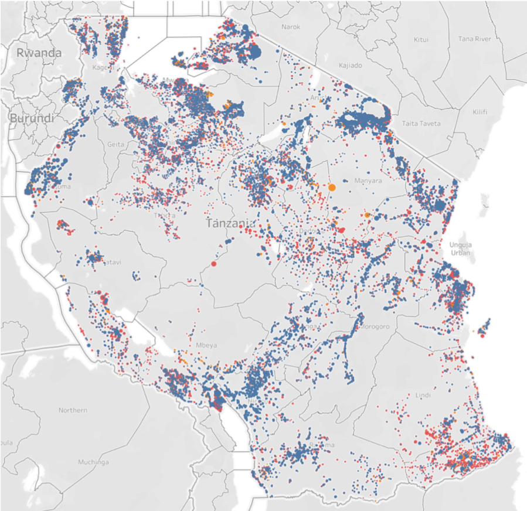
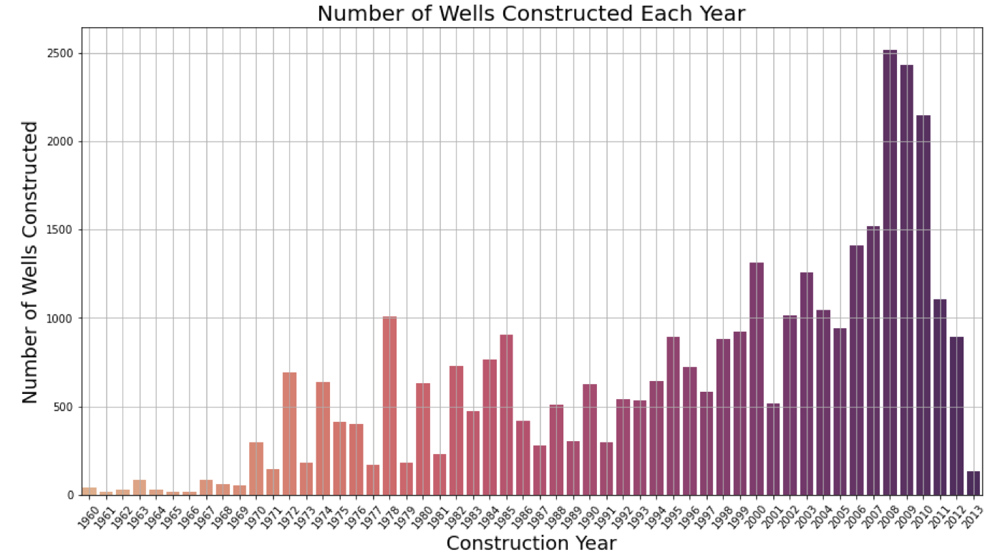
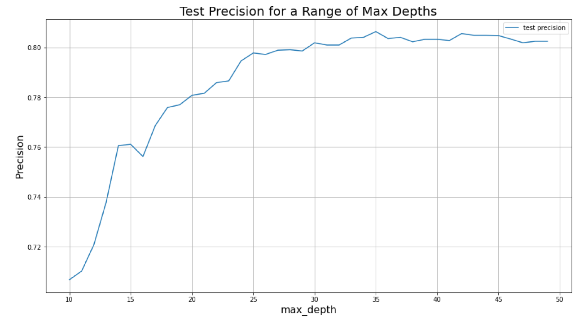

# Phase 3 Project
This is the repository that contains all files associated with the DS Flex Phase 3 Project.

## Project Overview

This project uses a classification model to predict which water pumps in Tanzania are in need of maintenance.

### Business Problem

Tanzania has water pumps installed throughout the country in order to make pottable water accessible to it's residents. Maintaining these water pumps can prove to be a challenge, since many are in remote areas that are difficult to monitor. 

The goal of this project is to build a model that can predict which water pumps are in need of repair in order to efficiently dispatch technicians to the sites most in need and provide as many people as possible with clean water. 

### The Data

A dataset of Tanzania water pumps is maintained by Taarifa in a waterpoints dashboard by aggregating data from the Tanzania Ministry of Water. This data set keeps track of information regarding the location of the water pump, information about the pump (contruction year, extraction type, etc.), the people involved in the pump (installers, management, population), as well as the information regarding the source of water feeding the pump.

Additionally, the training test set provided has another test set containing the id nubmer of every pump and wheter it is functional, functional but in need of repair, or non-functional. This will allow us to train and validate our model.

Prior to cleaning, there are 59,400 water pumps in the training data set.

Data file structure:
- all data can be found in the 'data' folder located in the primary project folder
- the data folder containes the following data files:
    - Training_set_values.csv: data containing the characterisitics of each water pump.
    - Training_set_labels.csv: functionality status of each water pump.
    - grid_results_accuracy.json: paramter grid search results for optimizing accuracy.
    - grid_results_f1.json: paramter grid search results for optimizing the f1 score.
    - grid_results_precision.json: paramter grid search results for optimizing precision.

### Data Overview

Locations of pumps across Tanzania:

Construction years of pumps:

### Analysis

The primary analysis work can be found in the jupityer notebook 'data_analysis.ipynb'

#### Data Cleaning: 
    - unnecessary or redundant columns removed
    - managed 'unknown' and 'other' categories
    - removed categories with only 1 or 2 occurances
    - remove any reamining NaN values

#### Data Analysis: 

##### Base Model: 
A base model was run in order to determine the starting point for building an optimized model and measure progress. 
- initial model: decision tree
- metric: precision
This produced a model with precision of 79.5%

A decision tree was chosen as the first model for it's ease of training and relatively quick run time.

Precision was chosen as it focusses on reducing false positives. It is better to visit a pump that was labeled as non-functional when it is actually functional (false negative) than to miss a pump that is labeled as functional when it is non-functional (false positive)

##### Hyperparameter tuning:
Four parameters were tuned to optimize the decision tree model, max_features, min_samples_split, min_samples_leaf, and max depth. Through this tuning a range of values for each was chosen to feed into a grid search.

example range of values for a specific parameter (in this case max_depth) and their resulting precision

##### Grid Search:
The ranges of values selected for each parameter during hyperparamter tuning were permutated to produce all possible combinations of parameters to search for the combination that produces the highest possible precision. 

##### Final Decision Tree:
The optimal paramters were used to generate a final decision tree, resulting in a precision of 80.1%

#### Final Model

##### Random Forest:
The hyperparamters chosen through the decision tree were then applied to a random forest. The random forest generates a "forest" of 100 randomized decision trees, then obtains a consensus from all 100, resulting in a precision of 80.5%

From the base model to the final random forest model, the following improvements in metrics were observed: 
- precision increased by 1.03%
- f1 score increased by 4.28%
- recall increased by 7.89%
- accuracy increased by 3.95%

##### Feature Importance:
The last analysis performed was to detemine the most important features to the model.
1. location (latitude, longitude, elevation)
2. water quantity
3. construction year
4. population.

### Recommendations

1. Identify regions with a high density of likely non-functional pumps to focus on. 
2. prioritize pumps by water quantity (with 'dry' at the top)
3. then prioritize by construction year, focussing on older pumps first

### Repository Structure
images Folder: images used in this ReadMe
data Folder: contains the original data set and grid search results.
pdfs Folder: contains the pdfs turned in as part of this project, including the presentation
data_analysis.ipynb: the jupyter notebook containing the primary analyses

### Contact Information

Abigail Campbell
abbycampbell0@gmail.com